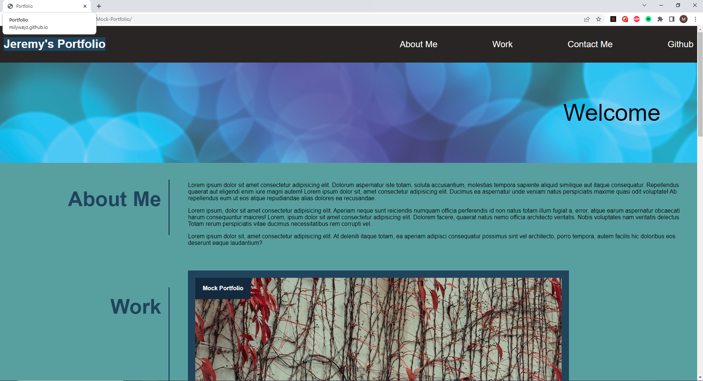
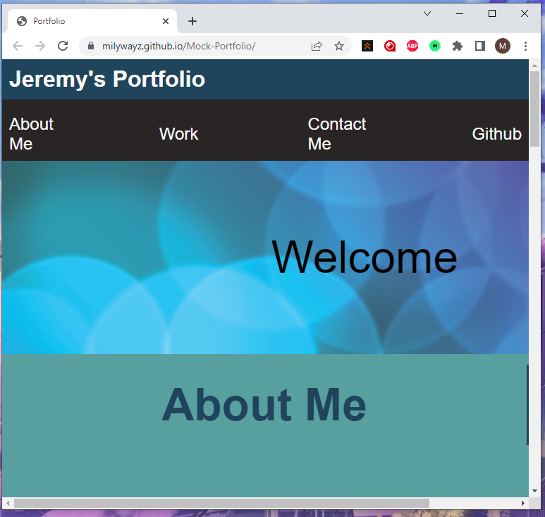
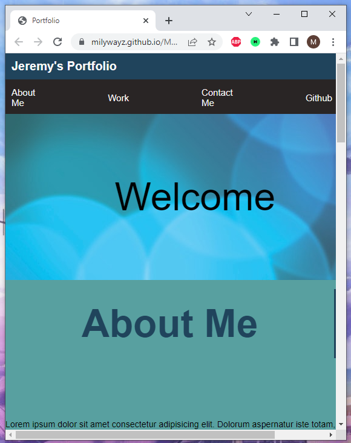

# Mock-Portfolio

## Link to Deployed Application

https://milywayz.github.io/Mock-Portfolio/

## Description

This project was made to make a mock portfolio while using HTML and CSS coding. It has a working clickable links to users previous work, scrolling UI on the header, and gives information of a portfolio. 

## Installation

N/A

## Usage
FullScreen

Max Width: 768px

Max Width: 576px  

   
## License

N/A

## Features

UI Scroll on Header
Clickable Images

